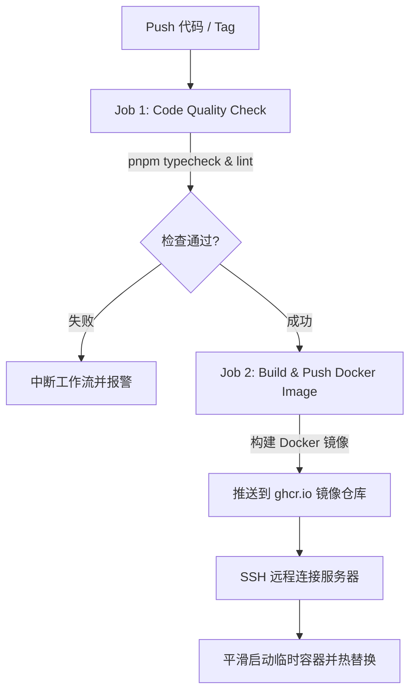

# Vue-Pure-Admin 前端运维与 CI/CD 最佳实践指南

本指南详细记录了项目在 **Nginx 配置**、**Docker 容器化构建**、**GitHub Actions CI/CD** 以及 **Jenkins 企业级流水线** 中的核心技术点、配置原理及运维注意事项，便于日后查阅与维护。

---

## 目录

1. [Nginx 高性能与安全配置详解](#1-nginx-高性能与安全配置详解)
2. [Docker 多阶段镜像构建与 Docker Compose 编排](#2-docker-多阶段镜像构建与-docker-compose-编排)
3. [GitHub Actions 自动化流水线与零停机部署](#3-github-actions-自动化流水线与零停机部署)
4. [Jenkins 企业级流水线设计与健康校验](#4-jenkins-企业级流水线设计与健康校验)
5. [常见问题排查与运维 Checklist](#5-常见问题排查与运维-checklist)

---

## 1. Nginx 高性能与安全配置详解

配置文件路径：[`docker/nginx.conf`](file:///e:/files/vue-pure-admin/docker/nginx.conf)

### 1.1 Single Page Application (SPA) 路由支持

Vue 前端路由使用 `history` 模式时，浏览器访问深层路径（如 `/system/user`）刷新页面会向服务器请求同名文件。若服务器不存在该文件则会返回 404。

```nginx
location / {
    try_files $uri $uri/ /index.html;
}
```

- **原理**：Nginx 会依次尝试按顺序查找对应的文件（`$uri`）、目录（`$uri/`），如果均未找到，则重定向兜底到 `/index.html`，交由 Vue Router 在客户端解析路由。

---

### 1.2 精准控制浏览器缓存策略

前端打包静态资源文件名通常带有 Content Hash（如 `app.a8f9c2.js`）。如果资源变动，Hash 会自动更名。

#### (1) `index.html` 强制禁用强缓存

`index.html` 是单页应用的入口文件，内部引用了最新的 JS/CSS Hash 文件名。必须确保用户每次打开网页都能拿到最新版 HTML：

```nginx
location = /index.html {
    add_header Cache-Control "no-cache, no-store, must-revalidate" always;
    add_header Pragma "no-cache" always;
    add_header Expires "0" always;
}
```

- **效果**：浏览器每次都会向服务器发起 HTTP 协商请求，保障发布新版本后用户能够 **秒级刷新生效**，无需手动清除缓存。

#### (2) 带 Hash 的静态资源强缓存 1 年

```nginx
location ~* \.(?:css|js|png|jpg|jpeg|gif|ico|svg|woff|woff2|ttf|eot)$ {
    expires 1y;
    add_header Cache-Control "public, max-age=31536000, immutable";
    add_header Access-Control-Allow-Origin "*";
    access_log off;
}
```

- **`immutable` 标志**：告诉现代浏览器该资源 **永不改变**，用户在刷新页面时连 `304 Not Modified` 请求都不必发送，大幅节省网络带宽高并发压力。
- **`Access-Control-Allow-Origin "*"`**：解决微前端架构或 CDN 加载字体文件（`.woff2` / `.ttf`）时可能出现的跨域拦截问题。

---

### 1.3 接口限流防刷与大文件上传限制

#### (1) 接口限流 (`limit_req_zone`)

```nginx
# 定义在 http 块
limit_req_zone $binary_remote_addr zone=api_limit:10m rate=10r/s;

# 引用在 /api/ location 块
location /api/ {
    limit_req zone=api_limit burst=20 nodelay;
    proxy_pass http://backend-service:8080/;
    ...
}
```

- **`$binary_remote_addr`**：使用二进制保存客户端 IP，10MB 空间（`10m`）可记录约 16 万个独立 IP 的访问状态。
- **`rate=10r/s`**：限制单个 IP 平均每秒处理不超过 10 个请求。
- **`burst=20 nodelay`**：设置容量为 20 的突发请求缓冲区，超过速率的请求无需延迟排队，在缓冲区内立即响应，超量后直接返回 503，防止防刷爆破。

#### (2) 允许大文件上传

```nginx
client_max_body_size 20M;
```

- 默认 Nginx 限制请求体大小为 `1MB`，若前端有图片上传、Excel 导入或文档上传功能，超出此限制将抛出 `413 Payload Too Large` 错误。

---

### 1.4 HTTPS & SSL 安全证书模板

在生产环境中开启 HTTPS 可防止网络劫持和数据篡改：

```nginx
server {
    listen 443 ssl http2;
    server_name yourdomain.com;

    ssl_certificate     /etc/nginx/certs/fullchain.pem;
    ssl_certificate_key /etc/nginx/certs/privkey.pem;
    ssl_protocols       TLSv1.2 TLSv1.3;
    ssl_ciphers         HIGH:!aNULL:!MD5;

    # 启用 HSTS 防范降级攻击
    add_header Strict-Transport-Security "max-age=31536000; includeSubDomains" always;

    root   /usr/share/nginx/html;
    index  index.html;

    location / {
        try_files $uri $uri/ /index.html;
    }
}
```

---

## 2. Docker 多阶段镜像构建与 Docker Compose 编排

配置文件路径：[`Dockerfile`](file:///e:/files/vue-pure-admin/Dockerfile) | [`docker-compose.yml`](file:///e:/files/vue-pure-admin/docker-compose.yml)

### 2.1 多阶段构建 (Multi-Stage Build) 原理

为了获得最小的容器体积与更高的安全防护， Dockerfile 分为编译阶段与生产运行阶段：

```dockerfile
# Stage 1: 编译打包阶段 (体积约 1GB+)
FROM node:20-alpine AS build-stage
WORKDIR /app
RUN corepack enable && corepack prepare pnpm@latest --activate
COPY package.json pnpm-lock.yaml .npmrc ./
RUN --mount=type=cache,id=pnpm,target=/root/.local/share/pnpm/store pnpm install --frozen-lockfile
COPY . .
ARG VITE_APP_ENV=production
RUN pnpm build --mode ${VITE_APP_ENV}

# Stage 2: 生产运行阶段 (最终镜像体积仅约 25MB - 35MB)
FROM nginx:alpine AS production-stage
COPY docker/nginx.conf /etc/nginx/nginx.conf
COPY --from=build-stage /app/dist /usr/share/nginx/html
EXPOSE 80
CMD ["nginx", "-g", "daemon off;"]
```

#### 核心优势：

1. **彻底分离依赖环境**：最终生成的镜像完全不包含 Node.js、源代码及 `node_modules`，攻击面极小。
2. **Docker BuildKit 缓存挂载**：
   `RUN --mount=type=cache,id=pnpm,target=/root/.local/share/pnpm/store ...`
   即使 `package.json` 或项目代码发生变动，Docker 宿主机仍然保留 pnpm 的全局包缓存，无需重新从网络下载所有依赖包，构建时间可降低 **60% - 80%**。

---

### 2.2 Docker Compose 编排特性

在宿主机部署时，通过 `docker-compose.yml` 统一管理容器生命周期：

```yaml
services:
  vue-pure-admin:
    build:
      context: .
      dockerfile: Dockerfile
    image: vue-pure-admin:latest
    container_name: vue-pure-admin-frontend
    restart: always
    ports:
      - "80:80"
    volumes:
      # 挂载宿主机配置文件与日志目录
      - ./docker/nginx.conf:/etc/nginx/nginx.conf:ro
      - ./logs/nginx:/var/log/nginx
    healthcheck:
      test:
        ["CMD", "wget", "--quiet", "--tries=1", "--spider", "http://localhost/"]
      interval: 30s
      timeout: 3s
      retries: 3
    logging:
      driver: "json-file"
      options:
        max-size: "10m"
        max-file: "3"
```

- **健康检查 (`healthcheck`)**：Docker 引擎会每隔 30 秒访问容器内部 `http://localhost/`，连续 3 次失败判定为 `unhealthy`。
- **日志轮转 (`logging`)**：限定单个日志文件最大 `10MB`，最多保留 3 个归档，防止日志暴增撑爆宿主机磁盘。

---

## 3. GitHub Actions 自动化流水线与零停机部署

配置文件路径：[`.github/workflows/docker-ci-cd.yml`](file:///e:/files/vue-pure-admin/.github/workflows/docker-ci-cd.yml)

### 3.1 两个核心 Job 职责拆分



---

### 3.2 零停机平滑发布 (Zero-Downtime Deployment)

常规的 `docker stop && docker run` 会在拉取镜像和启动新容器的窗口期造成 5-15 秒的服务中断（返回 502/连接拒绝）。

新的平滑更新脚本逻辑如下：

```bash
# 1. 拉取最新镜像
docker pull ghcr.io/user/repo:latest

# 2. 先拉起一个临时容器运行在备用端口 8080
docker run -d \
  --name vue-pure-admin-frontend-new \
  --restart always \
  -p 8080:80 \
  ghcr.io/user/repo:latest

# 3. 等待并校验新容器启动状态
sleep 3
if docker ps | grep vue-pure-admin-frontend-new > /dev/null; then
  # 确认新容器成功运行，无缝关停旧容器并启动正式端口
  docker stop vue-pure-admin-frontend || true
  docker rm vue-pure-admin-frontend || true
  docker stop vue-pure-admin-frontend-new
  docker rm vue-pure-admin-frontend-new

  docker run -d \
    --name vue-pure-admin-frontend \
    --restart always \
    -p 80:80 \
    ghcr.io/user/repo:latest
else
  echo "❌ 新容器启动失败，保持原有旧版本容器继续运行！"
  exit 1
fi
```

- **保障**：若新构建的镜像因配置错误无法启动，脚本会在临时阶段报错推出，**绝对不会切断当前线上正在运行的旧版容器**。

---

## 4. Jenkins 企业级流水线设计与健康校验

配置文件路径：[`Jenkinsfile`](file:///e:/files/vue-pure-admin/Jenkinsfile)

### 4.1 参数化构建与多环境隔离

流水线支持手动触发时选择参数：

- **`DEPLOY_ENV`**：`production` (生产环境) / `staging` (预发/测试环境)。
- **`SKIP_LINT`**：紧急发布时可勾选跳过代码检查。
- **`DOCKER_REGISTRY`**：支持阿里云 ACR (`registry.cn-hangzhou.aliyuncs.com`) 或企业私有 Harbor。

动态映射服务器 IP：

```groovy
environment {
    // 根据环境选择目标服务器 IP
    SERVER_IP = "${params.DEPLOY_ENV == 'production' ? '192.168.1.100' : '192.168.1.101'}"
}
```

---

### 4.2 部署后自动化健康校验 Stage

```groovy
stage('Health Verification') {
    steps {
        echo "===> [Stage 6] 校验部署结果与容器运行状态..."
        script {
            sshagent([env.SSH_CREDS_ID]) {
                sh """
                    ssh -o StrictHostKeyChecking=no root@${env.SERVER_IP} '
                        sleep 3
                        if docker ps | grep ${env.APP_NAME}-frontend > /dev/null; then
                            echo "✅ 容器服务运行正常！"
                        else
                            echo "❌ 容器未正常运行！"
                            exit 1
                        fi
                    '
                """
            }
        }
    }
}
```

---

## 5. 常见问题排查与运维 Checklist

### 5.1 修改 Nginx 配置后如何在生产环境生效？

如果在宿主机修改了 `./docker/nginx.conf`：

```bash
# 验证语法正确性
docker exec -it vue-pure-admin-frontend nginx -t

# 零中断热加载配置
docker exec -it vue-pure-admin-frontend nginx -s reload
```

### 5.2 构建镜像出现网络超时？

- **Node 阶段**：确认使用了镜像源 `RUN pnpm config set registry https://registry.npmmirror.com`。
- **Alpine 阶段**：如需在 Alpine 内安装工具，可配置阿里云 alpine 源：
  `RUN sed -i 's/dl-cdn.alpinelinux.org/mirrors.aliyun.com/g' /etc/apk/repositories`

### 5.3 刷新网页显示旧版本界面？

1. 检查浏览器 Console Network，查看 `index.html` 的响应头是否包含 `Cache-Control: no-cache`。
2. 确认发布时 Docker 镜像 tag 是否更新，避免使用旧镜像。
